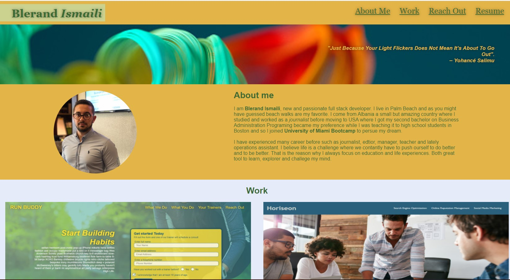

# Portfolio
- **Blerand Ismaili's Professional Portfolio**
- 
- **Direct link to it** <*https://blerandism.github.io/Portfolio/*>
- This is my first portfolio which I inted to use for the future by adding my project and making it visually better for potential job application.
- So far I have only done two project *Run Buddy* and *Horiseon* both using HTLM and CSS attributes. Both of those =- - project are included in my portfolio.
- I tried to keep it simple for the uses starting with my name, a navigation bar at the top with four options. When you hover over them they change color and create a background and when you click it they will send you to the respective box in the page. 
- My header fill follow the scrolling down and is in the same style as my footer where the are all my contact information and profesional social platforms such as, LinkedIn, GitHub and my Gmail.
- On my work section the user can clearly see two images of my previous work and if they click the image they will be directed to the actual website. 

# Contributors 
- **Blerand Ismaili** <*https://github.com/BlerandIsm*>
